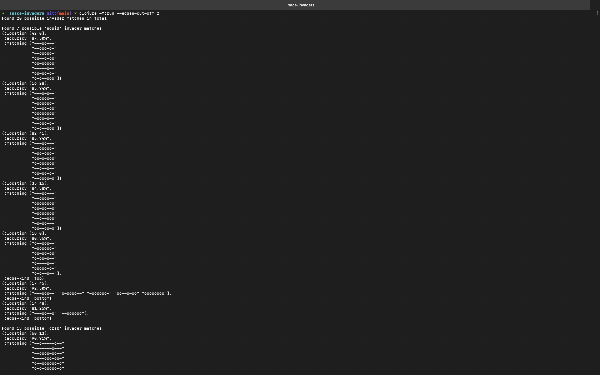
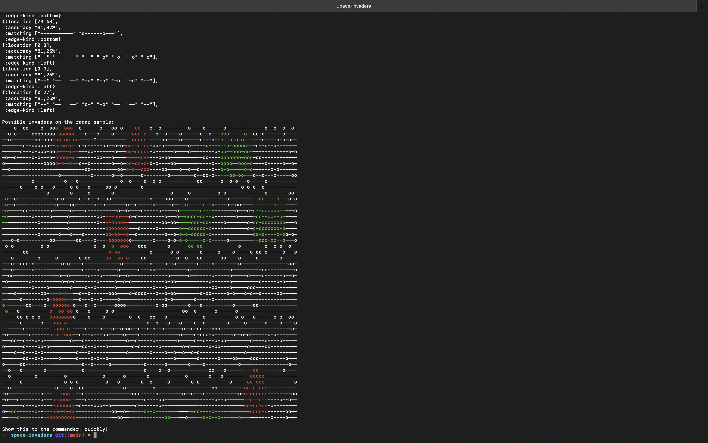

# Space Invaders Detector

A command line utility that is a solution to a development assignment.

For assignment details, see `metric-clojure-assignment.md`.

## Usage

1. Have **Clojure 1.12** installed locally
2. In the root dir, run `clojure -M:run --help`
3. Follow the instructions for args & opts to detect invaders

## Output

Here's an example output:

